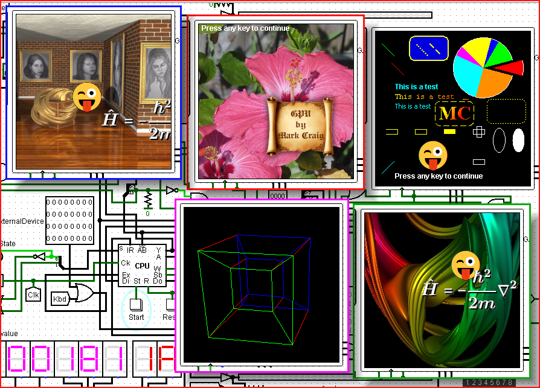
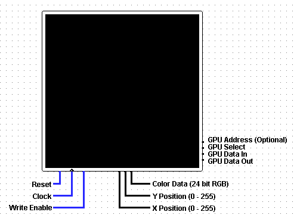

GPU Video Screen for Logisim
==================================================

 
## Introduction

This is a GPU (Graphics Processing Unit) component for the Logisim
(and Logisim Evolution) digital logic simulator program.  It can draw
points, lines, ovals/circles, polygons, text, rounded rectangles,
arcs, blits, and sprites.  It even can do several graphics operations
in one clock cycle by running a user specified "program".

If you don't have Logisim, here's a link to the original Logisim:
[https://sourceforge.net/projects/circuit/files/2.7.x/2.7.1/logisim-generic-2.7.1.jar/download](https://sourceforge.net/projects/circuit/files/2.7.x/2.7.1/logisim-generic-2.7.1.jar/download)
for a JAR file (which would be needed for building this component if you need to) and
[https://sourceforge.net/projects/circuit/files/latest/download](https://sourceforge.net/projects/circuit/files/latest/download)
for an executable version.
If those links don't work, try:
[http://www.cburch.com/logisim/](http://www.cburch.com/logisim/).
Alternatively, Logisim evolution (Reds-Heig) is available at:
[https://github.com/reds-heig/logisim-evolution](https://github.com/reds-heig/logisim-evolution).
And Kevin Walsh's version of Logisim Evolution is available at:
[https://github.com/kevinawalsh/logisim-evolution](https://github.com/kevinawalsh/logisim-evolution).

If using the JAR version, you would need to do something like the following to run it:

    java -jar logisim-generic-2.7.1.jar

(Your filename may vary)

## How To Use The GPU Component

This GPU video screen is a drop-in replacement for the existing LCD Video screens.  It
will do the normal LCD screen operations that you might be familiar with.  But, if you
set the GPU Select line to 1, 2, or 3, it will do extra GPU functions.  
The GPUs RAM and ROM can be loaded by clicking the right mouse button on the GPU
component and selecting the desired Load function on the menu.  Then choose the
desired image file.  Currently, an image file's first line must be the common Logisim
image file header of "<b>v2.0 raw</b>".  The data that would follow must be in hexadecimal.
Comments can be put in by starting the comment with a "<b>#</b>"  
A sample conversion program (<b>gpuelem.c</b>) is provided to help in converting
your data to something that can be used with the GPU component.  It's partially
meant as a guide, you may choose to use other means of conversion.  Each time it is
run, it will output to the file "<b>outhex</b>".  You should then append the contents
of outhex to your image file.  The number of memory elements that are used is
contained in a comment.  Use that value to help determine the memory address to
use to access any subsequent graphical elements that you may choose to append.
>**Tip**: If you want to convert a PNG image file to a sprite with a full alpha channel,
>you can use **pngtopnm** from the Netpbm package with the **-alpha** option to create
>a PGM file containing the alpha channel (and also use without the **-alpha** option
>to get the RGB data in the form of a PPM file).

### GPU Select Line
To write a value to the GPU's RAM, first set the GPU memory address (with GPU Select 1) -
the memory address being on the GPU Data In line.
Then write the desired value (being on the GPU Data In line) to the previously specified
memory address (with GPU Select 2).  To do a GPU function (using GPU Select 3) <b>that
requires the use of the GPU's RAM or ROM (ones not in italics in the GPU
Functions table)</b>, set the GPU memory address (with GPU Select 1) and then do the GPU
function using GPU Select 3 (value on the GPU Data In line).
By the way, a memory address that is set will be remembered
after subsequent operations, so no need to keep setting it if it doesn't need to be changed.
If the GPU function doesn't require the GPU's RAM or ROM, no need to set an address.
Currently, the GPU's RAM and ROM have a limit of 1048576 (100000 hex) 32-bit elements each.
Even though there is this limit, any address below 800000 hex is considered RAM space and
any address at or above 800000 hex is considered ROM space.  The GPU Data Out line will
always (and only) show the value of the RAM or ROM at the specified memory address.  By
the way, currently the GPU portion of the video screen in its default configuration doesn't require the Clock line to operate.  However, it is likely
that your design will effectively trigger a GPU operation on a clock cycle anyway.  You
can set the trigger type if you want, however.
  
<TABLE BORDER=2 bgcolor="#102054" STYLE='color: #ffffff' VALIGN=center CELLPADDING=4>
<TR>
<TH ALIGN=center STYLE='background-color: #00109f'><b>&nbsp;GPU Select&nbsp;</b></TD>
<TH ALIGN=center STYLE='background-color: #00109f'><b>&nbsp;Function</b></TD>
</TR>
<TR>
<TD ALIGN=center><b>0</b></TD>
<TD ALIGN=left><b>&nbsp;GPU not used - Behave like normal Video screen.</b></TD>
</TR>
<TR>
<TD ALIGN=center><b>1</b></TD>
<TD ALIGN=left><b>&nbsp;Set GPU memory address.</b></TD>
</TR>
<TR>
<TD ALIGN=center><b>2</b></TD>
<TD ALIGN=left><b>&nbsp;Write value to GPU memory.</b></TD>
</TR>
<TR>
<TD ALIGN=center><b>3</b></TD>
<TD ALIGN=left><b>&nbsp;Do GPU function.</b></TD>
</TR>
</TABLE>

### Alternate Way to Set GPU Address
Instead of using the GPU Select Line (value 1) to set the GPU memory address, you could
use the GPU Address pin on the GPU.  If the value on the pin isn't floating or error at
the time a GPU function is performed, the address will be whatever is on this pin at
the time.  If the value is floating (perhaps not connected to anything) or an error,
the address will be whatever the previous good address was (perhaps set by the
GPU Select Line).

### GPU Functions
Functions in italics don't need any data in the GPU's RAM or ROM.  00 means
the value doesn't matter, but there should be 2 hex characters in that place so the
function code (Byte1) will be in the right bit positions.  Byte1, Byte2, Byte3, and
Byte4 together make up a 32 bit value with Byte1 being the most significant.
For functions <b>3</b> and <b>4</b>, "Move to" specifies the start of a line segment
and "Line to" specifies the end point and draws it.  Any subsequent "Line to" will use
the last specified point as the start of a new line segment.
For text. there currently are 3 fonts defined (Arial Bold 12, Courier New 12, and Tahoma 11)
and up to 16 user-definable fonts.  The 3 defined fonts may depend on your system.
The user-definable fonts can be created by using function <b>20</b>.
For Text function <b>8</b>, the font number needs to
be specified.  It can be <b>0</b>, <b>1</b>, or <b>2</b> for the pre-defined fonts, or
<b>4</b> through <b>19</b> (decimal) for the user-defined fonts.  The Text Char function <b>9</b> uses Courier New 12.
Function <b>1f</b> can be used to define a linear color gradient.  Once specified, it applies
to most drawing functions until it is turned off by setting the <b>On</b> value to <b>0</b>.
It not only applies to filled objects (which would be expected), but it also
applies to text and lines, for example.
For function <b>14</b>, the values specified are indexes into a point storage section
of the GPU's memory.  The start address of a point storage section is specified by
using the GPU Select Line 1 function (Set GPU memory address).
For function <b>19</b>, <b>SolidDotDash</b> is the stroke type: <b>00</b> for solid lines, 
<b>01</b> for dotted lines, and <b>02</b> for dashed lines.  <b>Width</b> is the line width.
Function <b>1c</b> can be used to produce a "rubber band" effect, which is the use of
exclusive OR (XOR) drawing mode to draw an object and then erase it by drawing it again.
You most likely have seen this effect in paint programs, for example, when you draw
a line setting one point and dragging the line to the desired endpoint.
The Set pixel function (<b>11</b>) sets the specified pixel to the current GPU color.
For functions <b>b</b> and <b>d</b>, if the Image # or Sprite # respectively is greater
than 0, use already created blit or sprite respectively.
Currently there is a limit of 17 blit images (One on the fly
blit (#0) and 16 pre-created blit images (#1-#16)).  And a limit of 17 sprite images (One
on the fly sprite (#0) and 16 pre-created sprite images (#1-#16)).  You can turn off an
individual sprite by setting both it's X position and Y position to 255 (ff).
In general, due to the fact that positions are 1 byte, there can never be negative
positions.  Since this can be a problem for blits and sprites, there is a workaround -
the positional alignment can be changed.  By using functions <b>1d</b> and <b>1e</b>,
the x and y alignment can be set: <b>00</b> for the default alignment which is top and/or left,
<b>01</b> for bottom and/or right, and <b>02</b> for center.
Also, because of the previously mentioned 1 byte limitation, there can only be a maximum of a 256x256
pixel video screen.  That's why other resolutions aren't supported.  Similarly, blit and
sprite images can't be any bigger than 256 pixels width and 256 pixels height.
There are I believe
versions of Logisim Evolution that support 64 bits, which would then allow more bits for
the data, but I figure it will take some time for people to start making 64-bit CPUs, etc.
So for now, these limitations stand.
  
<TABLE BORDER=2 bgcolor="#102054" STYLE='color: #ffffff' VALIGN=center CELLPADDING=4>
<TR>
<TH ALIGN=center STYLE='background-color: #00109f'><b>&nbsp;Function&nbsp;</b></TD>
<TH ALIGN=center STYLE='background-color: #00109f'><b>&nbsp;Byte1&nbsp;</b></TD>
<TH ALIGN=center STYLE='background-color: #00109f'><b>&nbsp;Byte2&nbsp;</b></TD>
<TH ALIGN=center STYLE='background-color: #00109f'><b>&nbsp;Byte3&nbsp;</b></TD>
<TH ALIGN=center STYLE='background-color: #00109f'><b>&nbsp;Byte4&nbsp;</b></TD>
</TR>
<TR STYLE='background-color: #208028'>
<TD ALIGN=left><b><i>&nbsp;Clear screen with specified color</i></b></TD>
<TD ALIGN=center><b>0</b></TD>
<TD ALIGN=center><b>Red</b></TD>
<TD ALIGN=center><b>Green</b></TD>
<TD ALIGN=center><b>Blue</b></TD>
</TR>
<TR STYLE='background-color: #208028'>
<TD ALIGN=left><b><i>&nbsp;Set current color</i></b></TD>
<TD ALIGN=center><b>1</b></TD>
<TD ALIGN=center><b>Red</b></TD>
<TD ALIGN=center><b>Green</b></TD>
<TD ALIGN=center><b>Blue</b></TD>
</TR>
<TR>
<TD ALIGN=left><b>&nbsp;Line</b></TD>
<TD ALIGN=center><b>2</b></TD>
<TD ALIGN=center><b>00</b></TD>
<TD ALIGN=center><b>X Pos</b></TD>
<TD ALIGN=center><b>Y Pos</b></TD>
</TR>
<TR STYLE='background-color: #208028'>
<TD ALIGN=left><b><i>&nbsp;Move to</i></b></TD>
<TD ALIGN=center><b>3</b></TD>
<TD ALIGN=center><b>00</b></TD>
<TD ALIGN=center><b>X Pos</b></TD>
<TD ALIGN=center><b>Y Pos</b></TD>
</TR>
<TR STYLE='background-color: #208028'>
<TD ALIGN=left><b><i>&nbsp;Line to</i></b></TD>
<TD ALIGN=center><b>4</b></TD>
<TD ALIGN=center><b>00</b></TD>
<TD ALIGN=center><b>X Pos</b></TD>
<TD ALIGN=center><b>Y Pos</b></TD>
</TR>
<TR>
<TD ALIGN=left><b>&nbsp;Polyline</b></TD>
<TD ALIGN=center><b>5</b></TD>
<TD ALIGN=center><b>00</b></TD>
<TD ALIGN=center><b>X Pos</b></TD>
<TD ALIGN=center><b>Y Pos</b></TD>
</TR>
<TR>
<TD ALIGN=left><b>&nbsp;Polygon (closed)</b></TD>
<TD ALIGN=center><b>6</b></TD>
<TD ALIGN=center><b>00</b></TD>
<TD ALIGN=center><b>X Pos</b></TD>
<TD ALIGN=center><b>Y Pos</b></TD>
</TR>
<TR>
<TD ALIGN=left><b>&nbsp;Filled polygon</b></TD>
<TD ALIGN=center><b>7</b></TD>
<TD ALIGN=center><b>00</b></TD>
<TD ALIGN=center><b>X Pos</b></TD>
<TD ALIGN=center><b>Y Pos</b></TD>
</TR>
<TR>
<TD ALIGN=left><b>&nbsp;Text</b></TD>
<TD ALIGN=center><b>8</b></TD>
<TD ALIGN=center><b>Font #</b></TD>
<TD ALIGN=center><b>X Pos</b></TD>
<TD ALIGN=center><b>Y Pos</b></TD>
</TR>
<TR STYLE='background-color: #208028'>
<TD ALIGN=left><b><i>&nbsp;Text Char.</i></b></TD>
<TD ALIGN=center><b>9</b></TD>
<TD ALIGN=center><b>ASCII #</b></TD>
<TD ALIGN=center><b>X Pos</b></TD>
<TD ALIGN=center><b>Y Pos</b></TD>
</TR>
<TR>
<TD ALIGN=left><b>&nbsp;Create blit src</b></TD>
<TD ALIGN=center><b>a</b></TD>
<TD ALIGN=center><b>00</b></TD>
<TD ALIGN=center><b>00</b></TD>
<TD ALIGN=center><b>Image #</b></TD>
</TR>
<TR>
<TD ALIGN=left><b>&nbsp;Blit</b></TD>
<TD ALIGN=center><b>b</b></TD>
<TD ALIGN=center><b>Image #</b></TD>
<TD ALIGN=center><b>X Pos</b></TD>
<TD ALIGN=center><b>Y Pos</b></TD>
</TR>
<TR>
<TD ALIGN=left><b>&nbsp;Create sprite src</b></TD>
<TD ALIGN=center><b>c</b></TD>
<TD ALIGN=center><b>00</b></TD>
<TD ALIGN=center><b>00</b></TD>
<TD ALIGN=center><b>Sprite #</b></TD>
</TR>
<TR>
<TD ALIGN=left><b>&nbsp;Sprite</b></TD>
<TD ALIGN=center><b>d</b></TD>
<TD ALIGN=center><b>Sprite #</b></TD>
<TD ALIGN=center><b>X Pos</b></TD>
<TD ALIGN=center><b>Y Pos</b></TD>
</TR>
<TR STYLE='background-color: #208028'>
<TD ALIGN=left><b><i>&nbsp;Sprites on/off</i></b></TD>
<TD ALIGN=center><b>e</b></TD>
<TD ALIGN=center><b>00</b></TD>
<TD ALIGN=center><b>00</b></TD>
<TD ALIGN=center><b>On Flag</b></TD>
</TR>
<TR>
<TD ALIGN=left><b>&nbsp;Oval / Circle</b></TD>
<TD ALIGN=center><b>f</b></TD>
<TD ALIGN=center><b>00</b></TD>
<TD ALIGN=center><b>X Pos</b></TD>
<TD ALIGN=center><b>Y Pos</b></TD>
</TR>
<TR>
<TD ALIGN=left><b>&nbsp;Filled Oval / Circle</b></TD>
<TD ALIGN=center><b>10</b></TD>
<TD ALIGN=center><b>00</b></TD>
<TD ALIGN=center><b>X Pos</b></TD>
<TD ALIGN=center><b>Y Pos</b></TD>
</TR>
<TR STYLE='background-color: #208028'>
<TD ALIGN=left><b><i>&nbsp;Set pixel</i></b></TD>
<TD ALIGN=center><b>11</b></TD>
<TD ALIGN=center><b>00</b></TD>
<TD ALIGN=center><b>X Pos</b></TD>
<TD ALIGN=center><b>Y Pos</b></TD>
</TR>
<TR>
<TD ALIGN=left><b>&nbsp;Run GPU program</b></TD>
<TD ALIGN=center><b>12</b></TD>
<TD ALIGN=center><b>Address (Byte1)</TD>
<TD ALIGN=center><b>Address (Byte2)</b></TD>
<TD ALIGN=center><b>Address (Byte3)</b></TD>
</TR>
<TR>
<TD ALIGN=left><b>&nbsp;End GPU program</b></TD>
<TD ALIGN=center><b>13</b></TD>
<TD ALIGN=center><b>00</b></TD>
<TD ALIGN=center><b>00</b></TD>
<TD ALIGN=center><b>00</b></TD>
</TR>
<TR>
<TD ALIGN=left><b>&nbsp;LineV</b></TD>
<TD ALIGN=center><b>14</b></TD>
<TD ALIGN=center><b>00</TD>
<TD ALIGN=center><b>Pstart</b></TD>
<TD ALIGN=center><b>Pend</b></TD>
</TR>
<TR>
<TD ALIGN=left><b>&nbsp;Arc</b></TD>
<TD ALIGN=center><b>15</b></TD>
<TD ALIGN=center><b>00</TD>
<TD ALIGN=center><b>X Pos</b></TD>
<TD ALIGN=center><b>Y Pos</b></TD>
</TR>
<TR>
<TD ALIGN=left><b>&nbsp;Filled Arc</b></TD>
<TD ALIGN=center><b>16</b></TD>
<TD ALIGN=center><b>00</TD>
<TD ALIGN=center><b>X Pos</b></TD>
<TD ALIGN=center><b>Y Pos</b></TD>
</TR>
<TR>
<TD ALIGN=left><b>&nbsp;Rounded Rectangle</b></TD>
<TD ALIGN=center><b>17</b></TD>
<TD ALIGN=center><b>00</TD>
<TD ALIGN=center><b>X Pos</b></TD>
<TD ALIGN=center><b>Y Pos</b></TD>
</TR>
<TR>
<TD ALIGN=left><b>&nbsp;Filled Rounded Rectangle</b></TD>
<TD ALIGN=center><b>18</b></TD>
<TD ALIGN=center><b>00</TD>
<TD ALIGN=center><b>X Pos</b></TD>
<TD ALIGN=center><b>Y Pos</b></TD>
</TR>
<TR STYLE='background-color: #208028'>
<TD ALIGN=left><b><i>&nbsp;Set stroke type</i></b></TD>
<TD ALIGN=center><b>19</b></TD>
<TD ALIGN=center><b>00</b></TD>
<TD ALIGN=center><b>SolidDotDash</b></TD>
<TD ALIGN=center><b>Width</b></TD>
</TR>
<TR STYLE='background-color: #208028'>
<TD ALIGN=left><b><i>&nbsp;Start double buffer</i></b></TD>
<TD ALIGN=center><b>1a</b></TD>
<TD ALIGN=center><b>00</b></TD>
<TD ALIGN=center><b>00</b></TD>
<TD ALIGN=center><b>00</b></TD>
</TR>
<TR STYLE='background-color: #208028'>
<TD ALIGN=left><b><i>&nbsp;End double buffer</i></b></TD>
<TD ALIGN=center><b>1b</b></TD>
<TD ALIGN=center><b>00</b></TD>
<TD ALIGN=center><b>00</b></TD>
<TD ALIGN=center><b>00</b></TD>
</TR>
<TR STYLE='background-color: #208028'>
<TD ALIGN=left><b><i>&nbsp;Set XOR mode for drawing</i></b></TD>
<TD ALIGN=center><b>1c</b></TD>
<TD ALIGN=center><b>Red</b></TD>
<TD ALIGN=center><b>Green</b></TD>
<TD ALIGN=center><b>Blue</b></TD>
</TR>
<TR STYLE='background-color: #208028'>
<TD ALIGN=left><b><i>&nbsp;Set blit alignment</i></b></TD>
<TD ALIGN=center><b>1d</b></TD>
<TD ALIGN=center><b>Image #</b></TD>
<TD ALIGN=center><b>Xalign</b></TD>
<TD ALIGN=center><b>Yalign</b></TD>
</TR>
<TR STYLE='background-color: #208028'>
<TD ALIGN=left><b><i>&nbsp;Set sprite alignment</i></b></TD>
<TD ALIGN=center><b>1e</b></TD>
<TD ALIGN=center><b>Sprite #</b></TD>
<TD ALIGN=center><b>Xalign</b></TD>
<TD ALIGN=center><b>Yalign</b></TD>
</TR>
<TR>
<TD ALIGN=left><b>&nbsp;Gradient paint</b></TD>
<TD ALIGN=center><b>1f</b></TD>
<TD ALIGN=center><b>00</TD>
<TD ALIGN=center><b>00</b></TD>
<TD ALIGN=center><b>On</b></TD>
</TR>
<TR>
<TD ALIGN=left><b>&nbsp;Create user font</b></TD>
<TD ALIGN=center><b>20</b></TD>
<TD ALIGN=center><b>00</TD>
<TD ALIGN=center><b>00</b></TD>
<TD ALIGN=center><b>Userfont #</b></TD>
</TR>
<TR STYLE='background-color: #208028'>
<TD ALIGN=left><b><i>&nbsp;GPU Reset</i></b></TD>
<TD ALIGN=center><b>ff</b></TD>
<TD ALIGN=center><b>00</b></TD>
<TD ALIGN=center><b>00</b></TD>
<TD ALIGN=center><b>00</b></TD>
</TR>
</TABLE>

### Data Formats in GPU Memory
Each line definition is stored as a 32-bit value in memory: 

Each polyline/polygon definition is stored as a 32-bit value in memory specifying
the number of points followed by that many 16-bit values (the most significant
16 bits of the 32-bit number are ignored): 

Each text string consists of a set of 8-bit values (the most significant 24 bits
of each 32-bit number are ignored) which is terminated by a 0.  Currently, a
string will automatically terminate after 256 characters to avoid an infinite loop
in case you forget the 0 terminator.

Each user-definable font consists of a 16-bit value (the most significant 16 bits
of the 32-bit number are ignored) in memory specifying the font style and font size: 
 
followed by the font name which is a string consisting of 8-bit values (the most
significant 24 bits of each 32-bit number are ignored) which is terminated by a 0.
The style can be <b>0</b> for plain, <b>1</b> for bold, <b>2</b> for italic, or
<b>3</b> for bold-italic.

Each oval/circle is stored as a 32-bit value in memory: 

Each gradient paint is stored as 4 32-bit values in memory.  A gradient paint
is done by specifying the color at a certain starting point and the color at a
certain ending point.  Those points are stored in the first of the 4 values: 
 
The next 2 values of the set of 4 are the starting color and the ending color respectively.
They are of the form: 
 
If the alpha part is 0, that color is fully transparent.  If the alpha part is 255 (ff), that color is fully opaque.
The last value of the set of 4 is an 8-bit value (the most significant 24 bits are ignored) which is the cyclic flag
(a value of <b>0</b> means the gradient is acyclic, a value of <b>1</b> means the gradient is cyclic).  An acyclic gradient
means that areas outside of the range from the starting point to the ending point are clamped to the color of the nearest specified point.
A cyclic gradient continues to cycle the gradient colors beyond the range from the starting point to the ending point.

Each blit and sprite image is stored as a 16-bit value (the most significant 16 bits
of the 32-bit number are ignored) containing the resolution: 
 
followed by the image data consisting of <b>Width</b> times <b>Height</b> 32-bit values (no
padding needed for non-power-of-2 widths).  The values of width and height should be one less than the actual width and height since a typical resolution
could be 256 and 256 can't be stored in one byte.
In the case of blits, the most significant
8 bits of a pixel element in the image data are ignored: 
 
In the case of sprites, all 32 bits of a pixel element are used: 
 
If the alpha part of the pixel is 0, that pixel is fully transparent.  If the alpha
part is 255 (ff), that pixel is fully opaque (fully shown).

Each GPU program is stored as a collection of pairs of 32-bit values.  The first of
the pair is the GPU Select value, and the last of the pair is the GPU Data In value.
The program is terminated by an End GPU program function (<b>13 hex</b>).  By the
way, a GPU program can call a GPU program, and so on (as long as the stack size
limit isn't reached).  In general, be careful when computing the addresses of each
GPU program - it can be confusing having to think in terms of each GPU operation
being two 32-bit values.

Point data for the LineV function is stored as a consecutive list of 16-bit values (the
most significant 16 bits of the 32-bit number are ignored): 
 
Unlike the polygon function, the number of points is not part of this storage.

Each Arc is stored as a 32-bit value in memory: 
 
followed by another 32-bit value (all 32 bits are used - both are 16-bit values.  Might need to be careful about your CPU's Endianness if different than x86): 

Each Rounded Rectangle is stored as a 32-bit value in memory: 

## Building

JAR files are included, so there shouldn't be a need to build, but if you need
to...

Edit Makefile accordingly (to set filename and location of your Logisim program jar files (exe file will not work)).  Also, you must have Java JDK installed -
probably needs to be at least version 6.  Some versions of Logisim Evolution require version 21.

On Windows (assuming Microsoft Visual Studio and assuming DOS compiling
environment set up.  Adjust accordingly for other IDEs):

    nmake

On Linux:

    make -f Makefile.unix

to only compile the default version for (original) Logisim 2.7.1.

Or to compile all versions:

    nmake all
Or:

    make -f Makefile.unix all

Or to compile a specific version (such as Logisim Evolution 3.9.0):

    nmake GPU3.9.0
Or:

    make -f Makefile.unix GPU3.9.0

(Refer to the makefile for the various versions that can be compiled)

## Sample Circuit Files

Since not everyone has either designed their own CPU in Logisim or has access to one,
sample circuits are provided which access the GPU without a CPU involved.  All
the GPU instructions that a CPU would send to the GPU are embedded in the ROMs in
the sample circuits.  Various versions have been created to work with the
different versions of Logisim and therefore the different versions of the GPU
component.  For some of the faster versions of Logisim, you'll probably need to set the
Auto-Tick Frequency rather low to see everything.  If you feel there are missing frames
(it's skipping things), try lowering the tick frequency.  These sample circuits use the file
**gpu** which is automatically loaded into the GPU's ROM.

To use **rungpu4d.circ**, **rungpuhc4d.circ**, or **rungpuev4d.circ** files, you need to load the GPUs
RAM with the image file **gpu4dram** by clicking the right mouse button on the GPU
component and selecting "**Load RAM**" from the menu.  These sample circuits also use the
file **gpu4drom** which is automatically loaded into the GPU's ROM.

The sample circuits in the form "rungpu*a.circ" use the alternate way of specifying the
GPU memory address (rather than using the GPU Select Line (value 1)).

This table shows the sample files provided along with the version of Logisim
they are known to work with.  They may work with other versions not mentioned
however, but no guarantees.  **Ev** stands for **Evolution** and **hc** stands for Kevin
Walsh's **Holy Cross** version of Logisim Evolution.

<TABLE BORDER=2 bgcolor="#102054" STYLE='color: #ffffff' VALIGN=center CELLPADDING=4>
<TR>
<TH ALIGN=center STYLE='background-color: #00109f'><b>&nbsp;File&nbsp;</b></TD>
<TH ALIGN=center STYLE='background-color: #00109f'><b>&nbsp;Logisim Version&nbsp;</b></TD>
</TR>
<TR><TD ALIGN=center><b>rungpu.circ</b></TD><TD ALIGN=left><b>&nbsp;Logisim 2.7.1&nbsp;</b></TD></TR>
<TR><TD ALIGN=center><b>rungpuev.circ</b></TD><TD ALIGN=left><b>&nbsp;Logisim Ev. 3.9.0 and Logisim Ev. 4.0.0&nbsp;</b></TD></TR>
<TR><TD ALIGN=center><b>rungpuev2.circ</b></TD><TD ALIGN=left><b>&nbsp;Logisim Ev. 3.3.1hc&nbsp;</b></TD></TR>
<TR><TD ALIGN=center><b>rungpuev3.circ</b></TD><TD ALIGN=left><b>&nbsp;Logisim Ev. 2.13.22&nbsp;</b></TD></TR>
<TR><TD ALIGN=center><b>rungpuhc.circ</b></TD><TD ALIGN=left><b>&nbsp;Logisim Ev. 5.0.4hc&nbsp;</b></TD></TR>
<TR><TD ALIGN=center><b>rungpuhc2.circ</b></TD><TD ALIGN=left><b>&nbsp;Logisim Ev. 3.1.0hc&nbsp;</b></TD></TR>
<TR><TD ALIGN=center><b>rungpuhc3.circ</b></TD><TD ALIGN=left><b>&nbsp;Logisim Ev. 4.0.4hc&nbsp;</b></TD></TR>
<TR><TD ALIGN=center><b>rungpuhc4.circ</b></TD><TD ALIGN=left><b>&nbsp;Logisim Ev. 4.0.0hc and Logisim Ev. 4.0.1hc&nbsp;</b></TD></TR>
<TR><TD ALIGN=center><b>rungpuhc5.circ</b></TD><TD ALIGN=left><b>&nbsp;Logisim Ev. 5.0.5hc&nbsp;</b></TD></TR>
<TR><TD ALIGN=center><b>rungpu4d.circ</b></TD><TD ALIGN=left><b>&nbsp;Logisim 2.7.1&nbsp;</b></TD></TR>
<TR><TD ALIGN=center><b>rungpuev4d.circ</b></TD><TD ALIGN=left><b>&nbsp;Logisim Ev. 3.9.0 and Logisim Ev. 4.0.0&nbsp;</b></TD></TR>
<TR><TD ALIGN=center><b>rungpuhc4d.circ</b></TD><TD ALIGN=left><b>&nbsp;Logisim Ev. 5.0.4hc&nbsp;</b></TD></TR>
<TR><TD ALIGN=center><b>rungpuhc4d2.circ</b></TD><TD ALIGN=left><b>&nbsp;Logisim Ev. 5.0.5hc&nbsp;</b></TD></TR>
<TR><TD ALIGN=center><b>rungpua.circ</b></TD><TD ALIGN=left><b>&nbsp;Logisim 2.7.1&nbsp;</b></TD></TR>
<TR><TD ALIGN=center><b>rungpueva.circ</b></TD><TD ALIGN=left><b>&nbsp;Logisim Ev. 3.9.0 and Logisim Ev. 4.0.0&nbsp;</b></TD></TR>
<TR><TD ALIGN=center><b>rungpuev2a.circ</b></TD><TD ALIGN=left><b>&nbsp;Logisim Ev. 3.3.1hc&nbsp;</b></TD></TR>
<TR><TD ALIGN=center><b>rungpuev3a.circ</b></TD><TD ALIGN=left><b>&nbsp;Logisim Ev. 2.13.22&nbsp;</b></TD></TR>
<TR><TD ALIGN=center><b>rungpuhca.circ</b></TD><TD ALIGN=left><b>&nbsp;Logisim Ev. 5.0.4hc&nbsp;</b></TD></TR>
<TR><TD ALIGN=center><b>rungpuhc2a.circ</b></TD><TD ALIGN=left><b>&nbsp;Logisim Ev. 3.1.0hc&nbsp;</b></TD></TR>
<TR><TD ALIGN=center><b>rungpuhc3a.circ</b></TD><TD ALIGN=left><b>&nbsp;Logisim Ev. 4.0.4hc&nbsp;</b></TD></TR>
<TR><TD ALIGN=center><b>rungpuhc4a.circ</b></TD><TD ALIGN=left><b>&nbsp;Logisim Ev. 4.0.0hc and Logisim Ev. 4.0.1hc&nbsp;</b></TD></TR>
<TR><TD ALIGN=center><b>rungpuhc5a.circ</b></TD><TD ALIGN=left><b>&nbsp;Logisim Ev. 5.0.5hc&nbsp;</b></TD></TR>
</TABLE>

## Demonstration Videos

Youtube video (also showing my CPU design):
[Very Fast and Versatile GPU Component for my Logisim CPU / Computer (Blits, Sprites, Polygons, etc.)](https://www.youtube.com/watch?v=CsjMJFTHkPo)

## Possible Improvements

* A mouse click function could be added, so that when a user clicks
somewhere on the video screen, a program could get the location of the click.
This would allow for all sorts of things such as clickable menu systems and
playable games.  However, this goes beyond what a GPU does, so I think for
now it's just a thought.

* A GPU language (with variables, loops, subroutines, etc.) could be created that
would compile to "bytecode" (not to be confused with Java bytecode) that the GPU
would understand.  This would create a truly runnable program capability similar
to GLSL.  However, I don't really feel this makes much sense to do in the case of
this component since the strength of real-life GPUs is their ability to do
computations in parallel.  This component wouldn't be able to do that, and I don't
see any point in creating a pseudo-parallel system.

* Support for 3d graphics could be added.  It probably would be rather rudimentary
support, since a truly versatile 3d system would be rather complicated.

* Support for higher-level graphics primitives such as B-splines and B&#233;zier curves
could be added.

* In terms of tools, a gpuelem on steroids, so to speak, could be created - either
an interpreted "script" or a set of C++ classes (with each primitive being an "object"
in an object-oriented programming system) that would make GPU data/scene creation
easier.  In the C++ case, instantiating an object would add the object's data to
the GPU RAM file, and using the object's "place" (for example) method would add the
necessary GPU function call to the program.  Just thinking out loud :-)

* Support for radial gradient fills using Java's RadialGradientPaint
function.  However, RadialGradientPaint could be a bit of a hassle if you want to
do more than 2 gradient colors, specify a focus point, or specify the cycling
method.

* A sort of global translate function that would translate every primitive after it
until it's reset.  This way a complex scene could be created and translated as a
whole.  Would be useful for games, etc.

## Author

Mark Craig
[https://www.youtube.com/MrMcSoftware](https://www.youtube.com/MrMcSoftware)
